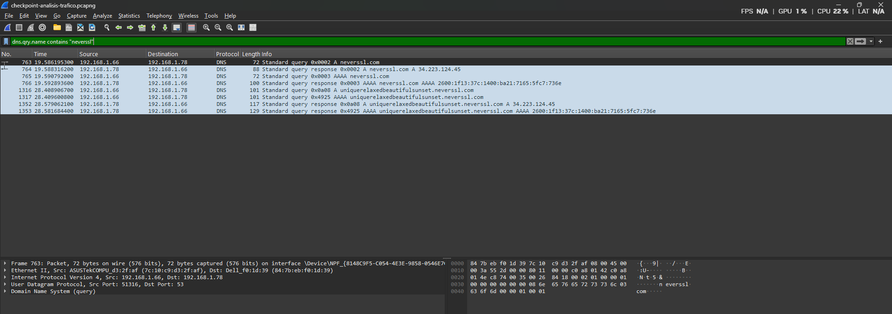
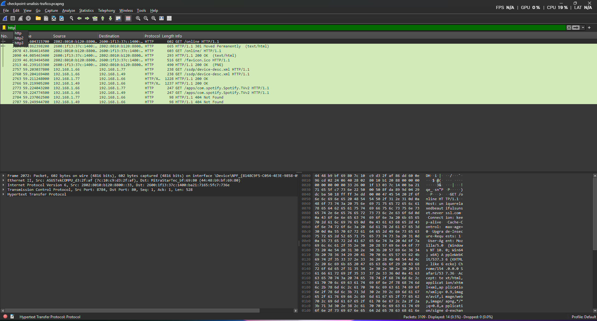
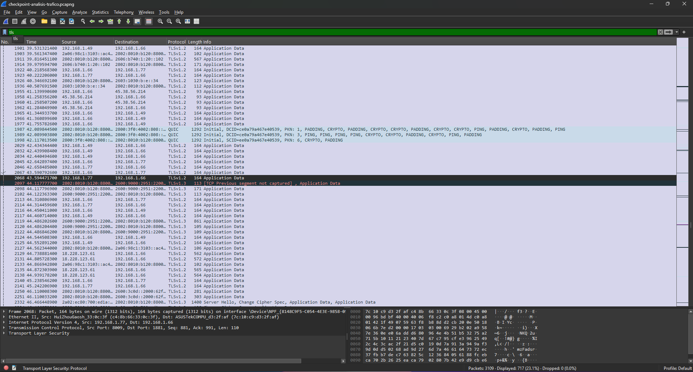
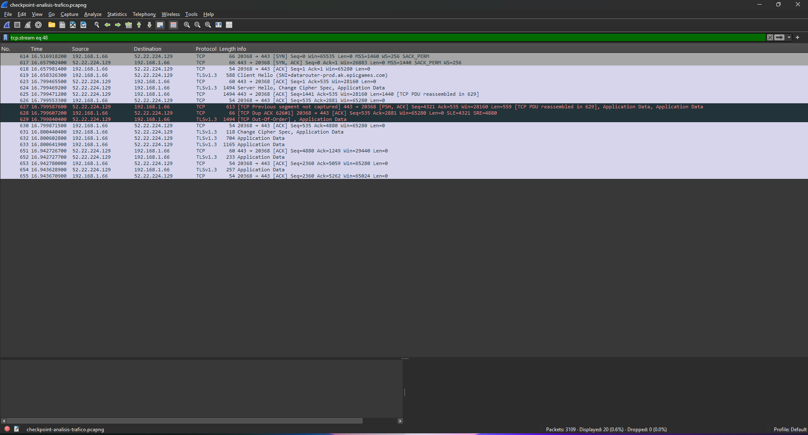

# Checkpoint: Mi primer laboratorio seguro de ciberseguridad

## Reporte Técnico de Configuración de Laboratorio

**Alumno:** Julián Martín Batistutti  
**Curso:** Ciberseguridad - Coderhouse  
**Virtualizador:** Oracle VirtualBox  
**Sistemas utilizados:** Kali Linux y Windows 11

## Introducción

El objetivo de esta práctica es construir y documentar un laboratorio controlado para realizar ejercicios de ciberseguridad reduciendo el riesgo para el equipo anfitrión. Se utilizaron máquinas virtuales Windows 11 y Kali Linux, aplicando aislamiento de red, principio de menor privilegio, gestión de actualizaciones, revisión de permisos en Linux y snapshots de recuperación.

## 1. La Fundación: VirtualBox y Red Aislada

La máquina virtual **CyberLab-Kali** fue configurada con el Adaptador 1 en modo **Red Interna**, utilizando la red `intnet`.

Esta modalidad mantiene la máquina virtual separada de la red física del equipo anfitrión y evita que Kali Linux se comporte como un dispositivo directamente visible dentro de la red doméstica. Para un laboratorio de ciberseguridad, este aislamiento reduce el riesgo de que futuras pruebas afecten accidentalmente otros dispositivos o servicios reales.

Para consultar los repositorios de Kali se habilitó **NAT de forma temporal**. NAT permite que la máquina virtual acceda a Internet sin exponerla directamente a la LAN como ocurriría con el modo Puente. Finalizada la consulta de actualizaciones, el laboratorio regresó a **Red Interna**.

### Evidencia de red


### ¿Por qué no utilizar modo Puente (Bridged)?

El modo Puente conecta la máquina virtual directamente con la red física y puede hacerla visible para otros dispositivos de la misma LAN. En un laboratorio destinado a análisis, pruebas y herramientas de seguridad esto representa una exposición innecesaria. Por ese motivo se priorizó Red Interna y se utilizó NAT únicamente cuando fue necesario acceder a Internet.

## 2. Capa Windows: Usuarios y Actualizaciones

### Principio de menor privilegio

En **CyberLab-Windows** se creó la cuenta local **UsuarioSeguro** y se configuró como **Usuario estándar**, separada de la cuenta con privilegios administrativos.

Esta configuración aplica el principio de menor privilegio: el usuario de trabajo dispone únicamente de los permisos necesarios para las tareas habituales y las modificaciones sensibles requieren autorización administrativa. Esto limita el impacto potencial de malware, errores humanos o cambios no autorizados.

### Evidencia del usuario estándar


### Windows Update

Se verificó el estado de **Windows Update** y el sistema informó **“¡Todo está actualizado!”**. La evidencia registra como última comprobación el **06/09/2026 a las 22:27**.

Mantener Windows actualizado permite recibir parches que corrigen vulnerabilidades conocidas y constituye una primera línea de defensa frente a fallas de seguridad que podrían ser explotadas por un atacante.

### Evidencia de Windows Update


## 3. Capa Linux: Permisos y Gestión

### Revisión de permisos con `ls -l`

En Kali Linux se creó el archivo `evidencia_permisos.txt` y se consultaron sus permisos mediante:

```bash
touch evidencia_permisos.txt
ls -l evidencia_permisos.txt
```

El resultado obtenido fue `-rw-rw-r--`. Esto indica que el propietario puede leer y escribir, el grupo puede leer y escribir, y los demás usuarios solamente pueden leer el archivo. La gestión correcta de permisos es fundamental para limitar el acceso y modificación de información dentro de Linux.

### Evidencia de permisos


### Gestión de actualizaciones con APT

Inicialmente, con la VM aislada en Red Interna, `sudo apt update` no pudo resolver `http.kali.org`, lo que confirma que el entorno no disponía de salida directa a Internet. Para realizar la comprobación de actualizaciones se habilitó **NAT temporalmente** y se volvió a ejecutar:

```bash
sudo apt update
```

Con NAT, la consulta accedió correctamente a los repositorios oficiales de Kali Linux, descargó la información de paquetes y detectó paquetes disponibles para actualización. `apt update` actualiza el índice local de paquetes; no instala por sí mismo las actualizaciones encontradas. Tras la comprobación, la VM se devolvió a Red Interna para conservar el aislamiento del laboratorio.

### Evidencia de permisos y gestión de paquetes


## 4. La Red de Seguridad: Snapshots

Antes de comenzar las modificaciones se conservó una instantánea denominada **Instalación Base Limpia**, que representa el estado inicial de Kali Linux.

### Evidencia del estado base


Luego de aplicar las configuraciones y comprobaciones del laboratorio se creó una segunda instantánea denominada:

**Clean Install - Hardening applied**

Este snapshot conserva un estado conocido del laboratorio después del hardening inicial. Si una práctica futura modifica o daña el entorno, la máquina virtual puede restaurarse sin repetir toda la instalación y configuración.

### Evidencia del snapshot final


## Conclusión

El laboratorio quedó preparado para futuras prácticas de ciberseguridad mediante virtualización, aislamiento de red, privilegios limitados, comprobación de actualizaciones, revisión de permisos en Linux y snapshots de recuperación.

La conectividad externa se utiliza únicamente cuando es necesaria para tareas de mantenimiento. Se evita el modo Puente y se mantiene el entorno de pruebas separado de la red física siempre que sea posible. El uso temporal de NAT permite obtener actualizaciones sin exponer directamente la máquina virtual a la LAN.

## Evidencias incluidas

- Configuración de Kali Linux en Red Interna (`intnet`).
- `UsuarioSeguro` configurado como Usuario estándar en Windows 11.
- Windows Update con el sistema actualizado.
- Permisos de `evidencia_permisos.txt` verificados mediante `ls -l`.
- Consulta de repositorios de Kali mediante `sudo apt update`.
- Snapshot inicial **Instalación Base Limpia**.
- Snapshot final **Clean Install - Hardening applied**.

## Reporte en PDF

Como respaldo adicional, el repositorio puede incluir el archivo **`Reporte_Tecnico_Laboratorio_JulianBatistutti.pdf`**, que reúne el reporte y las evidencias del checkpoint.

---

# Checkpoint: Análisis de tráfico e identificación de protocolos inseguros

## Introducción

En esta práctica se realizó una captura y análisis de tráfico de red utilizando Wireshark sobre la interfaz Ethernet del equipo anfitrión.

El objetivo fue identificar distintos protocolos presentes durante una navegación web, analizar las diferencias entre comunicaciones HTTP y HTTPS, observar el proceso de resolución DNS e identificar el establecimiento de una conexión TCP mediante el Three-Way Handshake.

La captura fue realizada generando tráfico hacia `http://neverssl.com` y otros servicios HTTPS.

---

## 1. Inventario de protocolos identificados

Durante la captura se identificaron distintos protocolos correspondientes a diferentes capas de comunicación.

| Protocolo | Función | Seguridad |
|---|---|---|
| DNS | Resolución de nombres de dominio a direcciones IP | Sin cifrado en DNS tradicional |
| TCP | Transporte confiable y orientado a conexión | No cifra por sí mismo |
| HTTP | Transferencia de contenido web | Inseguro |
| TLS | Cifrado de las comunicaciones | Seguro cuando está correctamente configurado |
| HTTPS | HTTP protegido mediante TLS | Seguro frente a lectura directa del tráfico |

La captura permitió observar cómo estos protocolos trabajan conjuntamente durante una navegación web.

---

## 2. Análisis DNS

Se utilizó el siguiente filtro de Wireshark:

```text
dns.qry.name contains "neverssl"
```

La consulta permitió identificar la resolución del dominio:

- **Dominio:** `neverssl.com`
- **Dirección IPv4 obtenida:** `34.223.124.45`
- **Tipo de registro:** A
- También se observó una consulta de tipo AAAA correspondiente a IPv6.

### Evidencia



DNS permite que el navegador obtenga la dirección IP correspondiente a un nombre de dominio antes de iniciar la comunicación con el servidor.

---

## 3. Análisis de tráfico HTTP

Para analizar las comunicaciones HTTP se utilizó:

```text
http
```

Durante la navegación hacia NeverSSL fue posible observar directamente solicitudes HTTP, incluyendo peticiones mediante el método `GET`.

En la captura se observa tráfico utilizando el **puerto TCP 80**, correspondiente a HTTP.

### Evidencia



Una característica importante observada es que Wireshark permite visualizar información de la solicitud, incluyendo elementos como:

- método HTTP;
- URI solicitada;
- encabezados;
- Host;
- información del navegador.

Esto demuestra uno de los principales problemas de HTTP: **la información no está protegida mediante cifrado**.

Un atacante con capacidad para interceptar el tráfico podría potencialmente leer o modificar información transmitida mediante HTTP.

---

## 4. Análisis HTTPS y TLS

Para identificar comunicaciones cifradas se utilizó:

```text
tls
```

Durante la captura se observaron comunicaciones utilizando **TLS 1.2 y TLS 1.3**.

### Evidencia



A diferencia del tráfico HTTP, en las conexiones protegidas mediante TLS el contenido de aplicación aparece en Wireshark principalmente como:

```text
Application Data
```

Esto ocurre porque los datos se encuentran cifrados.

Por lo tanto, observando únicamente una captura de red no es posible leer directamente el contenido de la página, formularios, credenciales u otra información protegida por la sesión TLS.

HTTPS proporciona principalmente:

- **Confidencialidad:** dificulta que terceros puedan leer la información.
- **Integridad:** permite detectar modificaciones de los datos durante la comunicación.
- **Autenticación:** los certificados digitales permiten verificar la identidad del servidor.

---

## 5. Three-Way Handshake de TCP

Para localizar conexiones TCP se utilizó inicialmente:

```text
tcp.flags.syn == 1
```

Posteriormente se aisló una conexión mediante su TCP Stream.

En la captura se identificó el establecimiento de una conexión entre:

```text
192.168.1.66 → 52.22.224.129:443
```

### Evidencia



Los tres paquetes identificados fueron:

### 1. SYN

```text
192.168.1.66 → 52.22.224.129
20368 → 443 [SYN]
```

El cliente solicita iniciar una conexión TCP con el servidor.

### 2. SYN, ACK

```text
52.22.224.129 → 192.168.1.66
443 → 20368 [SYN, ACK]
```

El servidor confirma la solicitud y comunica que está preparado para establecer la conexión.

### 3. ACK

```text
192.168.1.66 → 52.22.224.129
20368 → 443 [ACK]
```

El cliente confirma la respuesta del servidor.

Luego de estos tres pasos, la conexión TCP queda establecida.

En la misma captura se observa posteriormente un **TLSv1.3 Client Hello**, mostrando que después de establecer la conexión TCP comienza la negociación TLS correspondiente a la comunicación segura.

---

## 6. Análisis de seguridad

### ¿Por qué HTTP es considerado inseguro?

HTTP transmite la información sin proporcionar cifrado a nivel de aplicación. Esto permite que un tercero con acceso al tráfico pueda inspeccionar información enviada entre el cliente y el servidor.

Por este motivo no deberían transmitirse credenciales, datos personales u otra información sensible mediante HTTP.

### ¿Qué información pudo observarse en HTTP?

Durante la captura fue posible identificar información como:

- método utilizado;
- Host;
- URI;
- encabezados HTTP;
- información del cliente;
- códigos de respuesta.

La posibilidad de observar estos datos directamente demuestra la falta de confidencialidad de HTTP.

### ¿Qué ventajas ofrece HTTPS?

HTTPS utiliza TLS para proteger la comunicación entre el navegador y el servidor.

Esto proporciona confidencialidad e integridad a los datos y permite autenticar al servidor mediante certificados digitales.

Aunque un analista de red todavía puede observar determinados metadatos de la conexión, el contenido de aplicación queda protegido mediante cifrado.

### ¿Cómo protegería una VPN este tipo de comunicación?

Una VPN crea un túnel cifrado entre el dispositivo y el servidor VPN.

Esto impide que dispositivos intermedios de la red local puedan inspeccionar directamente el tráfico transportado dentro del túnel.

Sin embargo, una VPN no reemplaza HTTPS. La utilización conjunta de **HTTPS + VPN** proporciona protección en diferentes partes de la comunicación.

---

## 7. Conclusiones

La práctica permitió analizar de forma directa el funcionamiento de diferentes protocolos utilizados diariamente en una red.

Mediante Wireshark fue posible observar la resolución DNS, solicitudes HTTP sin cifrar, comunicaciones protegidas mediante TLS y el establecimiento de conexiones TCP mediante el Three-Way Handshake.

La comparación entre HTTP y HTTPS permitió comprobar la importancia del cifrado en las comunicaciones modernas. Mientras HTTP permite inspeccionar directamente gran parte de la información intercambiada, HTTPS utiliza TLS para proteger el contenido.

Como buenas prácticas de seguridad se recomienda:

- utilizar HTTPS siempre que sea posible;
- evitar transmitir información sensible mediante HTTP;
- mantener navegadores y sistemas actualizados;
- utilizar redes confiables;
- considerar una VPN cuando se utilizan redes públicas o no confiables;
- analizar periódicamente el tráfico de red ante comportamientos sospechosos.

---

**Autor:** Julián Martín Batistutti  
**Curso:** Ciberseguridad - Coderhouse
