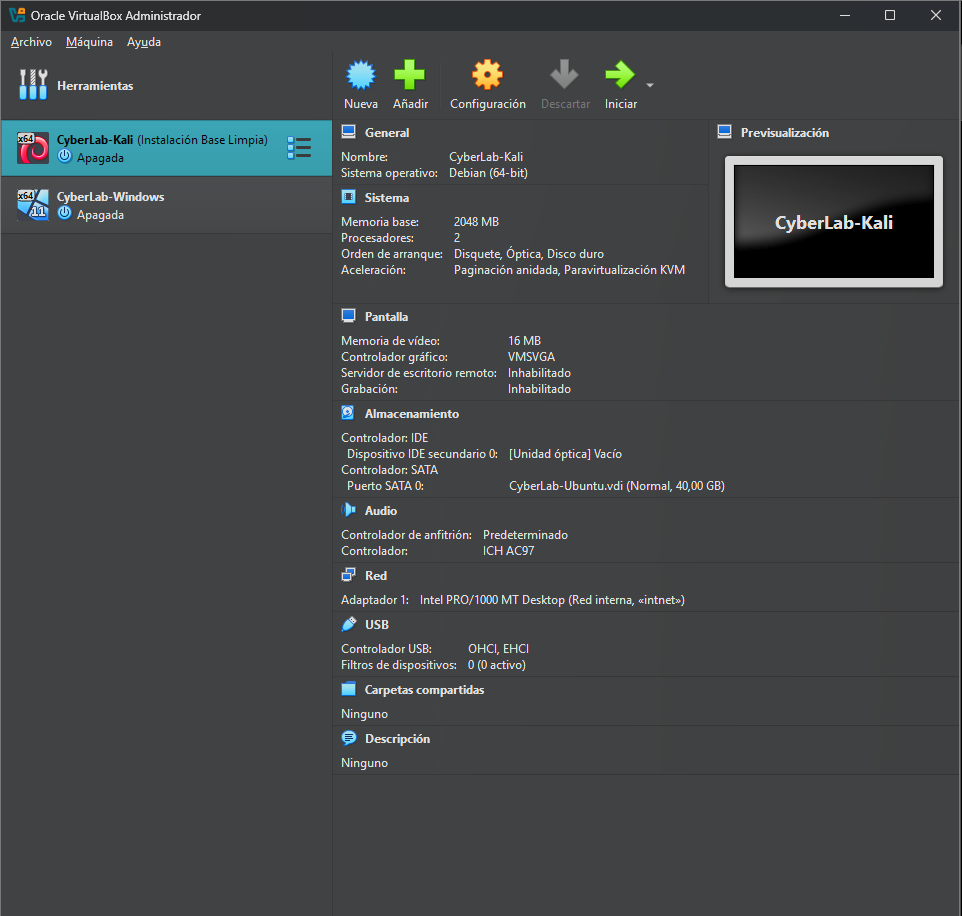
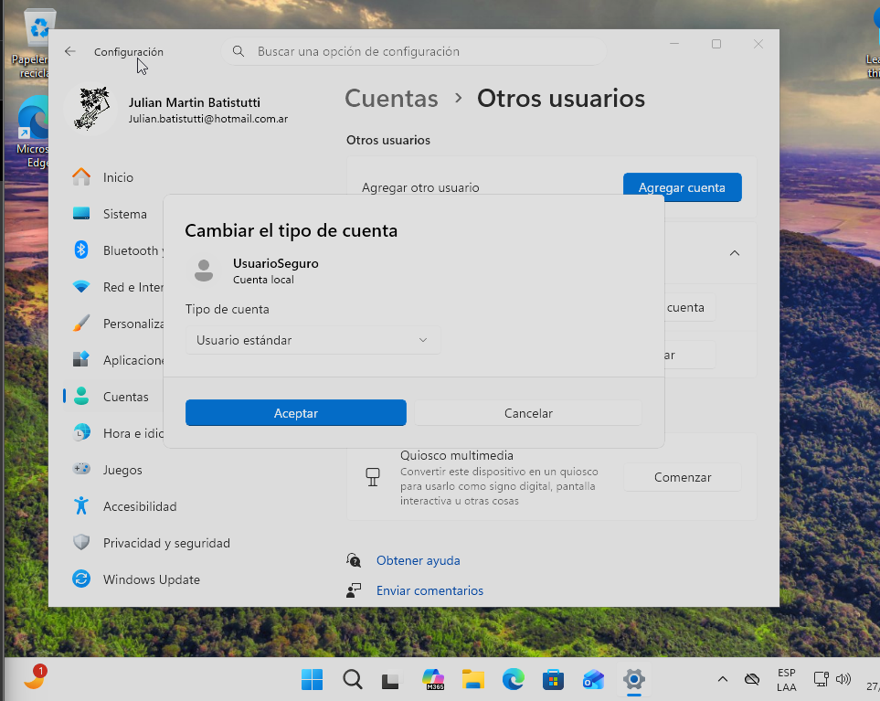
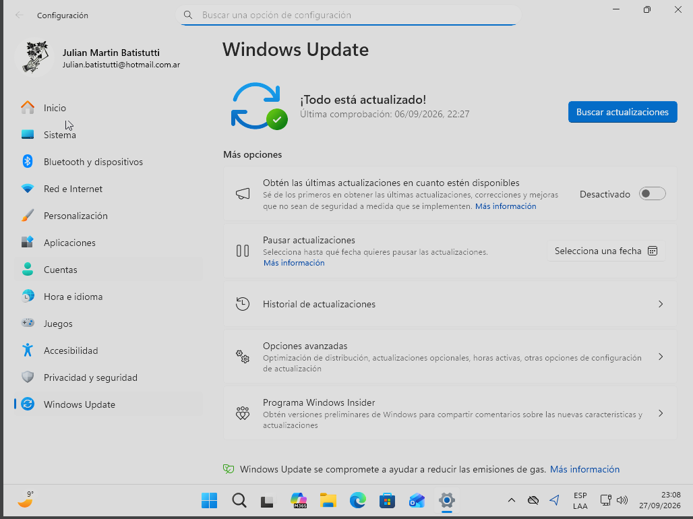
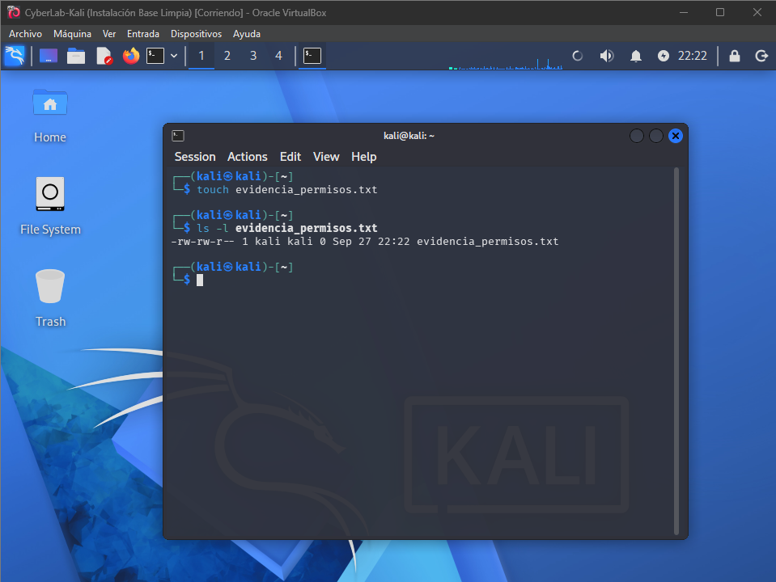
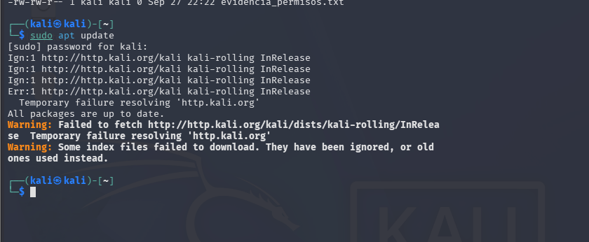
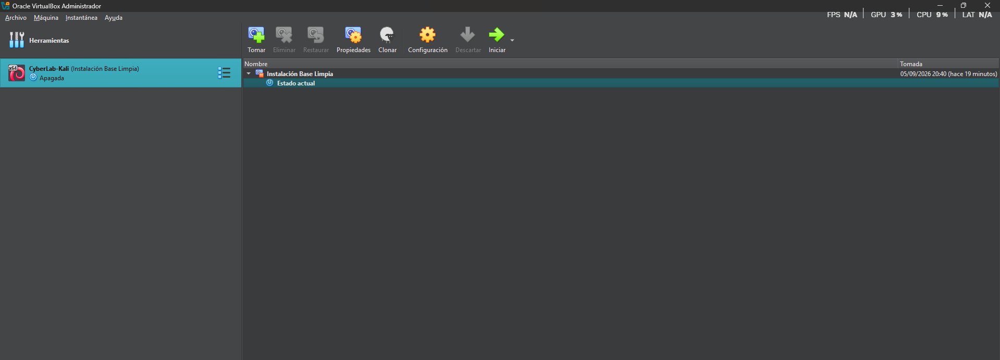
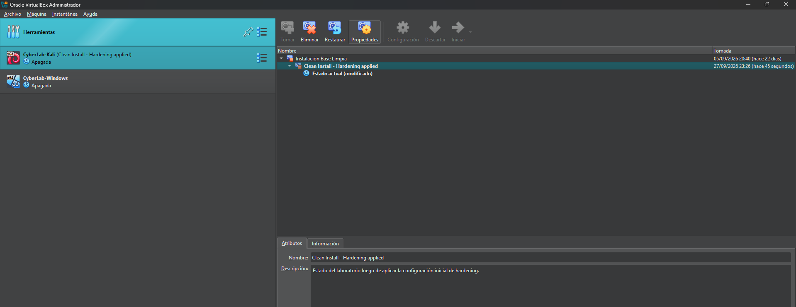

# Checkpoint: Mi primer laboratorio seguro de ciberseguridad

## Reporte Técnico de Configuración de Laboratorio

**Alumno:** Julián Martín Batistutti  
**Curso:** Ciberseguridad - Coderhouse  
**Virtualizador:** Oracle VirtualBox  
**Sistemas utilizados:** Kali Linux y Windows 11

## Introducción

El objetivo de esta práctica es construir y documentar un laboratorio controlado para realizar ejercicios de ciberseguridad reduciendo el riesgo para el equipo anfitrión. Se utilizaron máquinas virtuales Windows 11 y Kali Linux, aplicando aislamiento de red, principio de menor privilegio, gestión de actualizaciones, revisión de permisos en Linux y snapshots de recuperación.

## 1. La Fundación: VirtualBox y Red Aislada

La máquina virtual **CyberLab-Kali** fue configurada con el Adaptador 1 en modo **Red Interna**, utilizando la red `intnet`.

Esta modalidad mantiene la máquina virtual separada de la red física del equipo anfitrión y evita que Kali Linux se comporte como un dispositivo directamente visible dentro de la red doméstica. Para un laboratorio de ciberseguridad, este aislamiento reduce el riesgo de que futuras pruebas afecten accidentalmente otros dispositivos o servicios reales.

Para consultar los repositorios de Kali se habilitó **NAT de forma temporal**. NAT permite que la máquina virtual acceda a Internet sin exponerla directamente a la LAN como ocurriría con el modo Puente. Finalizada la consulta de actualizaciones, el laboratorio regresó a **Red Interna**.

### Evidencia de red



### ¿Por qué no utilizar modo Puente (Bridged)?

El modo Puente conecta la máquina virtual directamente con la red física y puede hacerla visible para otros dispositivos de la misma LAN. En un laboratorio destinado a análisis, pruebas y herramientas de seguridad esto representa una exposición innecesaria. Por ese motivo se priorizó Red Interna y se utilizó NAT únicamente cuando fue necesario acceder a Internet.

## 2. Capa Windows: Usuarios y Actualizaciones

### Principio de menor privilegio

En **CyberLab-Windows** se creó la cuenta local **UsuarioSeguro** y se configuró como **Usuario estándar**, separada de la cuenta con privilegios administrativos.

Esta configuración aplica el principio de menor privilegio: el usuario de trabajo dispone únicamente de los permisos necesarios para las tareas habituales y las modificaciones sensibles requieren autorización administrativa. Esto limita el impacto potencial de malware, errores humanos o cambios no autorizados.

### Evidencia del usuario estándar



### Windows Update

Se verificó el estado de **Windows Update** y el sistema informó **“¡Todo está actualizado!”**. La evidencia registra como última comprobación el **06/09/2026 a las 22:27**.

Mantener Windows actualizado permite recibir parches que corrigen vulnerabilidades conocidas y constituye una primera línea de defensa frente a fallas de seguridad que podrían ser explotadas por un atacante.

### Evidencia de Windows Update



## 3. Capa Linux: Permisos y Gestión

### Revisión de permisos con `ls -l`

En Kali Linux se creó el archivo `evidencia_permisos.txt` y se consultaron sus permisos mediante:

```bash
touch evidencia_permisos.txt
ls -l evidencia_permisos.txt
```

El resultado obtenido fue `-rw-rw-r--`. Esto indica que el propietario puede leer y escribir, el grupo puede leer y escribir, y los demás usuarios solamente pueden leer el archivo. La gestión correcta de permisos es fundamental para limitar el acceso y modificación de información dentro de Linux.

### Evidencia de permisos



### Gestión de actualizaciones con APT

Inicialmente, con la VM aislada en Red Interna, `sudo apt update` no pudo resolver `http.kali.org`, lo que confirma que el entorno no disponía de salida directa a Internet. Para realizar la comprobación de actualizaciones se habilitó **NAT temporalmente** y se volvió a ejecutar:

```bash
sudo apt update
```

Con NAT, la consulta accedió correctamente a los repositorios oficiales de Kali Linux, descargó la información de paquetes y detectó paquetes disponibles para actualización. `apt update` actualiza el índice local de paquetes; no instala por sí mismo las actualizaciones encontradas. Tras la comprobación, la VM se devolvió a Red Interna para conservar el aislamiento del laboratorio.

### Evidencia de permisos y gestión de paquetes




## 4. La Red de Seguridad: Snapshots

Antes de comenzar las modificaciones se conservó una instantánea denominada **Instalación Base Limpia**, que representa el estado inicial de Kali Linux.

### Evidencia del estado base



Luego de aplicar las configuraciones y comprobaciones del laboratorio se creó una segunda instantánea denominada:

**Clean Install - Hardening applied**

Este snapshot conserva un estado conocido del laboratorio después del hardening inicial. Si una práctica futura modifica o daña el entorno, la máquina virtual puede restaurarse sin repetir toda la instalación y configuración.

### Evidencia del snapshot final



## Conclusión

El laboratorio quedó preparado para futuras prácticas de ciberseguridad mediante virtualización, aislamiento de red, privilegios limitados, comprobación de actualizaciones, revisión de permisos en Linux y snapshots de recuperación.

La conectividad externa se utiliza únicamente cuando es necesaria para tareas de mantenimiento. Se evita el modo Puente y se mantiene el entorno de pruebas separado de la red física siempre que sea posible. El uso temporal de NAT permite obtener actualizaciones sin exponer directamente la máquina virtual a la LAN.

## Evidencias incluidas

- Configuración de Kali Linux en Red Interna (`intnet`).
- `UsuarioSeguro` configurado como Usuario estándar en Windows 11.
- Windows Update con el sistema actualizado.
- Permisos de `evidencia_permisos.txt` verificados mediante `ls -l`.
- Consulta de repositorios de Kali mediante `sudo apt update`.
- Snapshot inicial **Instalación Base Limpia**.
- Snapshot final **Clean Install - Hardening applied**.

## Reporte en PDF

Como respaldo adicional, el repositorio puede incluir el archivo **`Reporte_Tecnico_Laboratorio_JulianBatistutti.pdf`**, que reúne el reporte y las evidencias del checkpoint.
